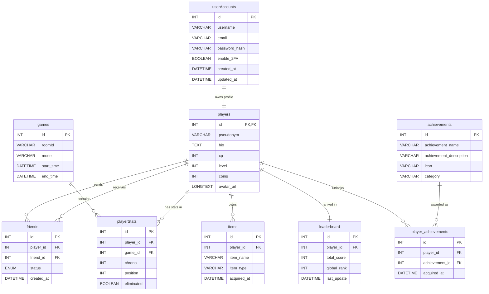

_This project has been created as part of the 42 curriculum by aneumann, enzuguem, fbouteil, mhanarte and zmeliani._

# Description

ft_transcendence is a full-stack web project from the 42 curriculum focused on building a modern multiplayer experience in the browser.

The project combines user management, authentication, profile and friends features, match history, and real-time gameplay. Our implementation includes a 3D game client, online interactions, and a containerized architecture to keep development and deployment consistent across environments.

The stack is split into dedicated services (API, game backend, frontend, database, and reverse proxy), orchestrated with Docker Compose. The goal is to deliver both a solid product structure and a polished gameplay experience.

# Instructions 

Create a .env file at the root of the repository and add credentials just like in the .env.example file. 

Clone the repository and use the command : 

make

Then open a browser and visit the url : 

localhost:8080

click "advanced" and accept the SSL certificate.

For multiplayer gameplay (42 LAN environment) : 

Modify the ./frontend/vite.config.js file to add your post number (ex : f6r9s4) to the allowed_hosts list. 
Then anyone on the network can open a browser and visit the url 'http://[postnumber]:8080' and join the server to play. 

# Resources

- Project roadmap: [doc/ROADMAP_MULTIPLAYER.md](doc/ROADMAP_MULTIPLAYER.md)
- Frontend notes: [READMEfront.md](READMEfront.md) and [frontend/READfrontend.md](frontend/READfrontend.md)
- API documentation source: [api/docs/openapi.js](api/docs/openapi.js)
- Docker orchestration: [docker-compose.yml](docker-compose.yml)
- Official docs used during development:
	- Three.js: https://threejs.org/docs/
	- Express.js: https://expressjs.com/
	- Socket.IO: https://socket.io/docs/v4/
	- MariaDB: https://mariadb.com/kb/en/documentation/

# Modules

## Web

- A front-end framework (Tailwind) = 1pt
- Real time features (Websockets) = 2pt
- A public API to interact with the database = 2pt
- an ORM for the database = 1pt
- Custom-made design system with reusable components = 1pt

Total = 7pts

## Accessibility

- Additional browsers = 1pt

Total = 1pts

## User Management

- Standard user management and authentification = 2pt
- Game statistics and Match history = 1pt
- 2FA authentification = 1pt

Total = 4pts

## Gaming and user experience

- A complete web based game = 2pt
- Remote players = 2pt
- Multiplayer game = 2pt
- A second game = 2pt
- 3D Graphics = 2pt 
- Gamification system = 1pt

total = 11pts 

## Total module points : 23pts 

# Database Schema

The application uses a relational MariaDB schema centered around user accounts, player profiles, social relationships, match persistence, and achievements.

## Entity Relationship Overview

## Main Tables and Relationships

- `userAccounts` stores authentication data and account-level settings.
- `players` extends each account with gameplay-facing profile data.
- `friends` models player-to-player social links and request status.
- `games` stores each persisted match.
- `playerStats` links players to games and stores per-match results.
- `achievements` stores achievement definitions.
- `player_achievements` links achievements to players.
- `leaderboard` stores ranking-related aggregate data.
- `items` stores unlockable or collectible player inventory data.

## Key Fields and Data Types

| Table | Key fields | Purpose |
|---|---|---|
| `userAccounts` | `id INT`, `username VARCHAR(50)`, `email VARCHAR(100)`, `password_hash VARCHAR(255)`, `enable_2FA BOOLEAN` | Authentication and account identity |
| `players` | `id INT`, `pseudonym VARCHAR(50)`, `bio TEXT`, `xp INT`, `level INT`, `avatar_url LONGTEXT` | Public player profile and progression |
| `friends` | `player_id INT`, `friend_id INT`, `status ENUM('pending','accepted')` | Friend requests and accepted friendships |
| `games` | `id INT`, `roomId VARCHAR(255)`, `mode VARCHAR(100)`, `start_time DATETIME`, `end_time DATETIME` | Match persistence |
| `playerStats` | `player_id INT`, `game_id INT`, `chrono INT`, `position INT`, `eliminated BOOLEAN` | Per-player match results |
| `achievements` | `achievement_name VARCHAR(50)`, `achievement_description VARCHAR(200)`, `category VARCHAR(50)` | Achievement catalogue |
| `player_achievements` | `player_id INT`, `achievement_id INT`, `acquired_at DATETIME` | Achievement ownership |
| `leaderboard` | `player_id INT`, `total_score INT`, `global_rank INT` | Ranking data |
| `items` | `player_id INT`, `item_name VARCHAR(100)`, `item_type VARCHAR(50)` | Player inventory / unlockables |

# Features List

The project includes the following implemented features:

- User registration, login, logout, and protected account access.
- Two-factor authentication (2FA) for additional account security.
- Player profile management with pseudonym, bio, avatar, XP, and level progression.
- Friends system with friend search, friend requests, accepted friendships, and request management.
- Match history and game statistics persistence.
- Achievements and gamification systems tied to player progression.
- Leaderboard and ranking display.
- Lobby system for solo, random multiplayer, and private room flows.
- Real-time multiplayer communication using Socket.IO.
- A complete browser-based 3D game experience.
- Multiple game modes, including a second playable mode.
- Responsive frontend pages and reusable UI/design system components.
- Public REST API for authentication, profiles, friends, match history, and achievements.
- Dockerized multi-service deployment with frontend, API, backend, nginx, and MariaDB.

# Roles

# Fbouteil — Product Owner & Game Designer

For ft_transcendence, I took the Product Owner role and helped define the overall direction of the project.

## Product Owner Responsibilities

- Defined the project vision and kept the team aligned with a clear gameplay and product goal.
- Organized priorities and coordinated tasks across the team to keep delivery consistent during sprints.
- Managed day-to-day collaboration, communication, and decision-making to maintain momentum.
- Balanced scope and quality by helping the team focus on features with the highest impact.

## Game Design & Client-Side Gameplay

I also led the game design and implemented most of the client-side gameplay experience.

- Designed the core feel of the game: jump behavior, movement responsiveness, platform interactions, and pacing.
- Implemented and tuned gameplay systems such as platforms, checkpoints, and progression flow.
- Built the 3D visual/gameplay layer in the browser with Three.js.
- Worked on front-end game logic and rendering to ensure a smooth and readable player experience.

### Main Technologies Used

- JavaScript (ES modules)
- Three.js (3D rendering and scene logic)
- HTML/CSS for UI integration around gameplay

# FRONTEND : ALBAN

## Overview 

The frontend of the project is made of several HTML pages. Eache page corresponds to one part of the webstites, such as the home page, login, and register pages, lobby, friends page, leaderboard, histoy and legales pages.

The HTML files are used to build scructure of each pages (example : sections, buttons, forms, links, cards and game areas.) THe the design and layout are managed with Tailwind CSS and our own custom CSS files. This allows us to keep the pages organized, responsive and visually 
consistent.

## Main Frontend Responsabilites

- Create the main user-facing pages of the application
- Create a cocherent visual identity, and re-use it.
- Handle navigation between pages through HTML links and page-specific scripts.
- Display user-oriented features such as profile data, achievements, history, rankings, and game access.
- Provide the visual layer for real-time and game-related interactions.

## Frontend Stack
- HTML for page structure
- CSS for styling and layout
- Tailwind CSS for utility layers and style compilation
- Vite for frontend tooling and build workflow
- JavaScript for page logic and dynamic interactions
- Three.js for 3D and game-related visual components

## Main Frontend Responsibilities
- Create the main user-facing pages of the application.
- Build a coherent visual identity across the whole platform.
- Handle navigation between pages through HTML links and page-specific scripts.
- Display user-oriented features such as profile data, achievements, history, rankings, and game access.
- Provide the visual layer for real-time and game-related interactions.

## Styling Architecture
The styling system is organized into source files with distinct roles:

- `frontend/src/styles/tokens.css`
  Contains the global design tokens used across the project: colors, fonts, spacing, shadows, border radius values, and shared visual constants.

- `frontend/src/styles/components.css`
  Contains reusable components and page-specific styles. This is where the design of pages such as `profil.html`, `friends.html`, `lobby.html`, and others is mainly written.

- `frontend/src/styles/tailwind.css`
  Acts as the main CSS entry point. It imports the source style files and includes the Tailwind layers.

- `frontend/assets/styles.css`
  This is the final compiled stylesheet loaded by the browser. It is generated automatically during the build process and should not be edited manually.

## Build Workflow
The frontend styles are not written directly in a single final CSS file. Instead, we work on the source files and let Tailwind compile everything into the final stylesheet used by the application.

The workflow is:

1. Create or update an HTML page.
2. Add or update classes in the page structure.
3. Write the visual rules in `components.css`, and use shared variables from `tokens.css`.
4. Compile the styles through the Tailwind build process.
5. Generate `assets/styles.css`, which is the file actually loaded by the browser.

This organization makes the frontend easier to maintain, cleaner to read, and more consistent when several contributors work on different pages at the same time.

## Main Pages Worked On
- `index.html`: landing page and main navigation entry point
- `register.html`, `already.html`, `2FA.html`: authentication-related pages
- `profil.html`: player profile, cloud stats, XP display, achievements, character showcase
- `friends.html`: profile-themed social page connected to the profile screen
- `lobby.html`: game mode selection and pre-game interface
- `leaderboard.html`, `leaderboard2.html`, `last_games.html`: ranking and history pages
- `gameRecap.html`, `gameFailed.html`: post-game recap screens

## Frontend Contributions
The frontend work included:
- Creating and structuring the main HTML pages of the application
- Building reusable UI sections and page-specific layouts
- Designing and organizing the CSS architecture
- Implementing a theme system based on shared visual tokens
- Creating responsive layouts for different screen sizes
- Improving readability and maintainability of the style files
- Connecting pages through navigation links and interface logic
